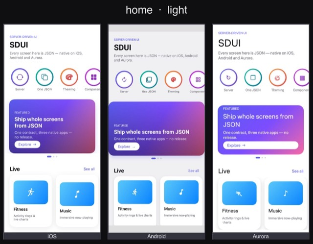
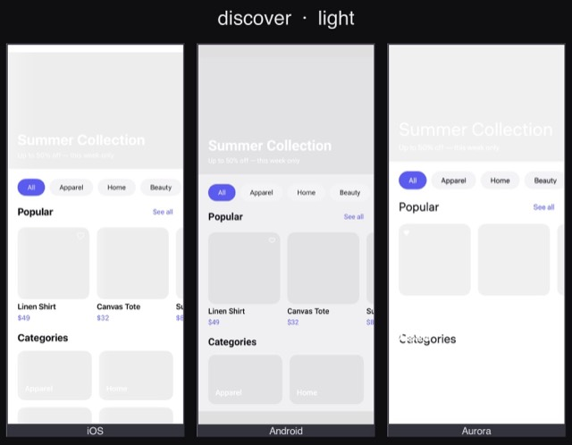
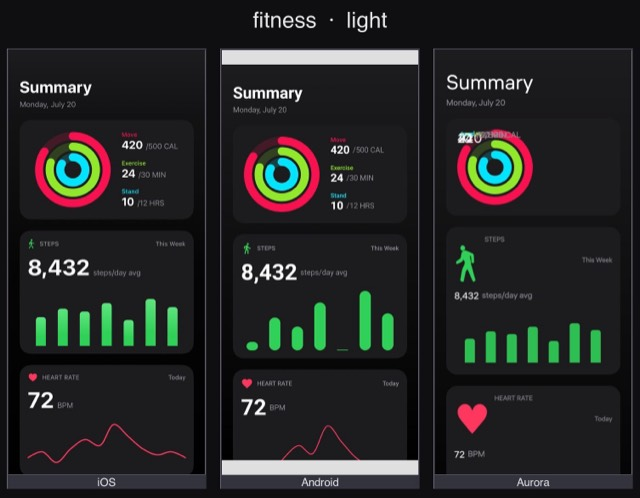
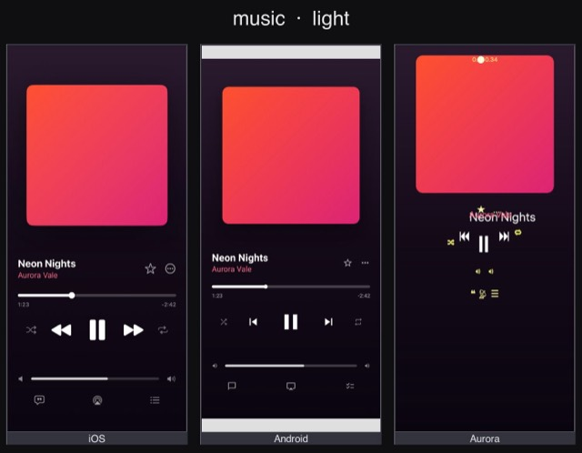
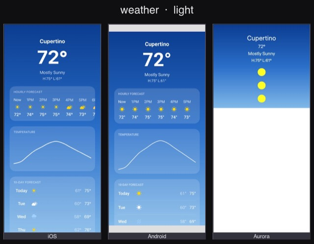
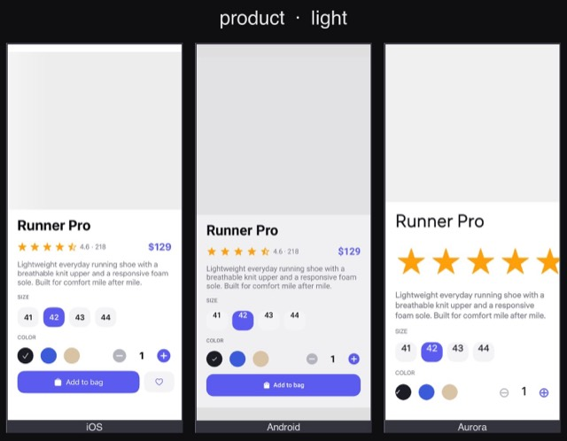
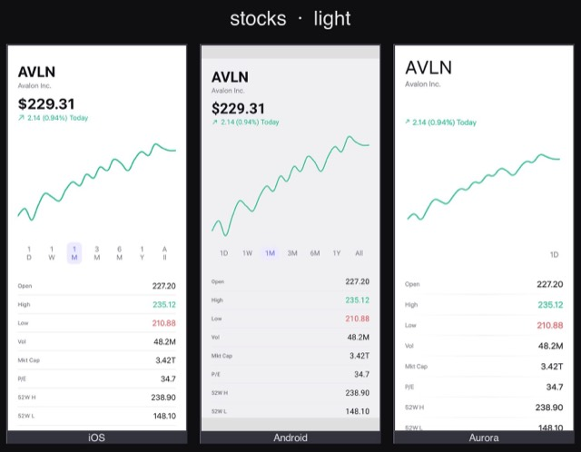
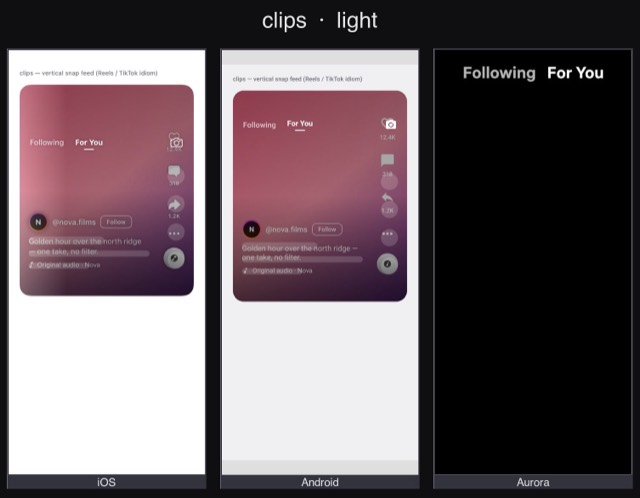
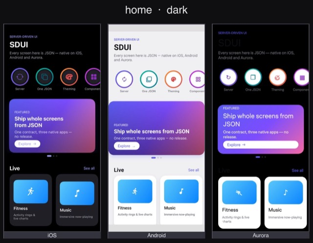

<div align="center">

# SDUI

### Ship whole native screens from your backend as JSON.

One platform-neutral contract renders **natively** on **iOS (SwiftUI)**, **Android (Jetpack Compose)** and **Aurora OS (Qt/Silica)** — same payload, same requests, no app release to change a screen.

[](https://github.com/bykhoda/sdui-engine/actions/workflows/ci.yml)
[](https://swift.org)
[](https://swift.org/package-manager)
[](PARITY.md)
[](LICENSE)

<br>

    

<sub>Every screen above is a JSON payload rendered by the engine — not hand-written native code.</sub>

</div>

---

## Why

Most product screens are content- and config-driven: feeds, forms, onboarding, promos, paywalls, settings, detail pages, checkouts. Those don't need a native release to change. SDUI moves them behind a strict, versioned JSON contract, so:

- **One payload, every platform.** The contract is platform-neutral. `vstack` → `VStack` / `Column` / `ColumnLayout`; `$token.spacing.md` resolves from a shared token file. Backends ship one response — iOS, Android and Aurora share requests.
- **Validated before it renders.** Every payload is checked against a JSON Schema ([`spec/schema/sdui.schema.json`](spec/schema/sdui.schema.json)) on the backend and decoded defensively on the client — an unknown component degrades to nothing, it never crashes.
- **Proven identical, not promised.** A shared [conformance corpus](#conformance) runs the same fixtures through a JS reference **and** the real native engine — binding resolution, condition evaluation and action effects must agree on every platform, or the build is red.
- **Small, extensible core.** A compact set of semantic primitives; anything native the format can't express is registered by the host app as a `custom.*` component. The SDK stays small, the format stays readable.

## Highlights

- **30 components** — layout (`vstack`/`hstack`/`zstack`/`grid`/`scroll`/`pager`), content (`text`/`image`/`icon`/`chart`/`rings`/`ticker`/`calendar`/`roadmap`), input (`textfield`/`toggle`/`picker`/`slider`/`datepicker`) and more — [full matrix →](PARITY.md)
- **24-verb action runtime** — `navigate`, `setState`, `sequence`, `parallel`, `condition`, `share`, `haptic`, `showToast`, `refresh`, `request`… declarative, composable side effects. A button doesn't *know* how to make a request; it fires an action the runtime interprets.
- **Two-way state & bindings** — `$data` / `$state` / `$item` / `$env` with a fallback-on-failure expression model; forms bind straight to state.
- **Serializable navigation** — `push` / `sheet` / `fullScreenCover`, deep links, dismiss-to-root; change a flow from the server.
- **Live theming** — colour, typography, spacing, radius as tokens over the wire, with separate light **and** dark palettes.
- **Native effects that feel native** — blur materials, haptics, Swift Charts with scrub, activity rings, collapsing headers, swipe-to-reveal, press feedback.

## Install

### iOS · Swift Package Manager

```swift
// Package.swift
dependencies: [
    .package(url: "https://github.com/bykhoda/sdui-engine.git", from: "0.1.0")
]
```

Or in Xcode: **File ▸ Add Package Dependencies…** and paste the repository URL. Products you can import: `SDUICore`, `SDUINetwork`, `SDUIRuntime`, `SDUIRender`, `SDUIPlayground`.

### Android · Jetpack Compose

The Compose renderer lives in [`android/sdui`](android) and consumes the identical contract. Maven Central / JitPack publishing is on the [roadmap](docs/blueprint/05-roadmap.md); today you include it as a Gradle module — see [`android/README.md`](android/README.md).

### Aurora OS · Qt/Silica

The Aurora renderer ([`aurora/`](aurora)) builds an RPM with the Aurora SDK — see [`aurora/README.md`](aurora/README.md).

## 60-second example

A screen is JSON. Bindings resolve against data you pass in; actions fire into the runtime.

```json
{
  "version": "0.1",
  "screen": {
    "id": "welcome",
    "content": {
      "type": "vstack",
      "spacing": "$token.spacing.md",
      "children": [
        { "type": "text", "value": "Hello, $data.user.name",
          "style": "$token.typography.largeTitle" },
        { "type": "button", "title": "Continue",
          "onTap": { "action": "navigate", "to": "home", "transition": "push" } }
      ]
    }
  }
}
```

Render it natively on iOS:

```swift
import SDUICore
import SDUINetwork
import SDUIRender

let document = try SDUIParser.decode(jsonData)          // structural validation
let tokens   = try JSONDecoder().decode(JSONValue.self, from: tokensData)
let loader   = DataLoader(resolver: StaticServiceResolver(
    services: ["catalog": URL(string: "https://api.example.com")!]))

SDUIScreenView(
    document: document,
    tokens: tokens,
    env: ["locale": .string("en"), "theme": .string("light")],
    loader: loader,
    delegate: myRouter                                  // navigation, analytics, share
)
```

Register a native escape-hatch component when the format can't express something:

```swift
let registry = ComponentRegistry()
registry.register("custom.map") { component, ctx in
    AnyView(MapView(latitude: component.prop("latitude")?.doubleValue ?? 0))
}
```

## The core idea: four orthogonal languages in one JSON

```
Layout / Components — what to draw   (the view tree + modifiers + tokens)
Actions            — what to do     (declarative, composable side effects)
Data / Network     — where data is  (services, requests, bindings)
Navigation         — how to move    (push / sheet / cover / deep links)
```

They never mix. This separation is what keeps the format portable and the renderers dumb.

## What's in the box

| | iOS | Android | Aurora |
|---|:---:|:---:|:---:|
| Components | 30 / 30 | 30 / 30 | 30 / 30 |
| Action verbs | 23 / 24 | 21 / 24 | 19 / 24 |

iOS is the reference renderer (built + tested on every commit). Android and Aurora hold parity against it, gated by CI and the conformance corpus. The numbers are generated from the actual renderer source — regenerate with `node spec/tools/parity.mjs > PARITY.md`. Live matrix: **[PARITY.md](PARITY.md)**.

<div align="center">
    
</div>

## Conformance

"Renders the same on every platform" is a **test**, not a promise. A shared corpus under [`spec/conformance/`](spec/conformance) runs every fixture through a JS reference (`check.mjs`) **and** the real native engine (iOS `SDUIConformanceTests`), asserting identical validation, binding resolution, condition evaluation and action effects. Drift is a red build.

```bash
node spec/conformance/check.mjs      # JS reference — validation / bindings / conditions / effects
node spec/conformance/coverage.mjs   # 100% of the contract surface is fixtured
```

## Visual composer

A browser composer at [`spec/compose/index.html`](spec/compose/index.html) builds screens by direct manipulation — drag on the canvas, set spacing with handles, edit colours in place — with a binding-resolving preview and a live, validated JSON export.

```bash
node spec/tools/serve.mjs            # serves the composer + the reference screens to edit
```

## Repository layout

```
spec/                         # THE SOURCE OF TRUTH (platform-neutral)
  schema/sdui.schema.json     #   the contract — validates every payload
  examples/ · conformance/    #   reference screens + shared fixture corpus
  compose/ · tools/ · docs/   #   visual composer · validate/codegen/parity/serve/mcp · protocol docs
ios/                          # Swift Package — SwiftUI renderer (the REFERENCE)
android/                      # Jetpack Compose renderer (same contract)
aurora/                       # Aurora OS — Qt/QML/Silica renderer (same contract)
Package.swift                 # root manifest so SwiftPM installs straight from the repo URL
PARITY.md                     # generated renderer parity matrix
docs/                         # authoring guide, blueprint, component/action reference
```

## Documentation

- **[Authoring guide](spec/docs/authoring.md)** — write a screen by hand
- **[Component](docs/reference/components.md) · [Modifier](docs/reference/modifiers.md) · [Action](docs/reference/actions.md) reference**
- **[Backend guide](docs/backend-guide.md)** — build a native app from JSON alone
- **[Design notes](docs/design-notes.md)** — prior art (DivKit, Airbnb, Lyft, Nubank) and the cross-platform rules the contract follows
- **[Blueprint](docs/blueprint/)** — the working hub: audits, parity plans, roadmap

## Contributing

Contributions are welcome — see [CONTRIBUTING.md](CONTRIBUTING.md) and the [Code of Conduct](CODE_OF_CONDUCT.md). Every renderer feature is a schema field + validator rule + parity-matrix entry + conformance fixture; nothing ships unverified.

## License

[Apache-2.0](LICENSE).
